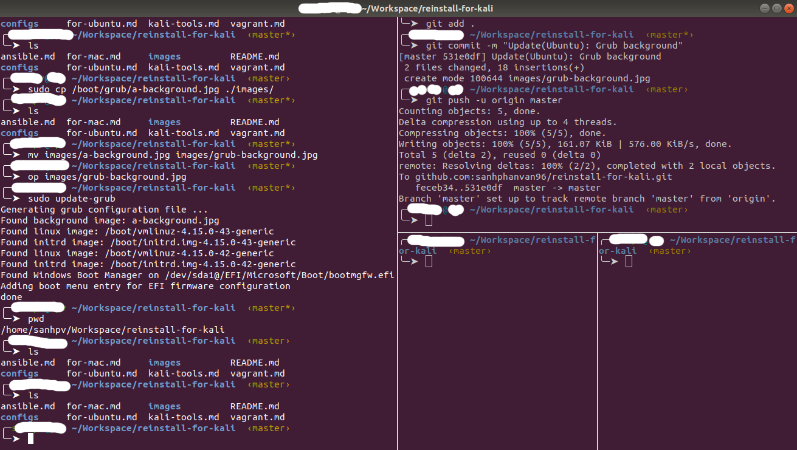
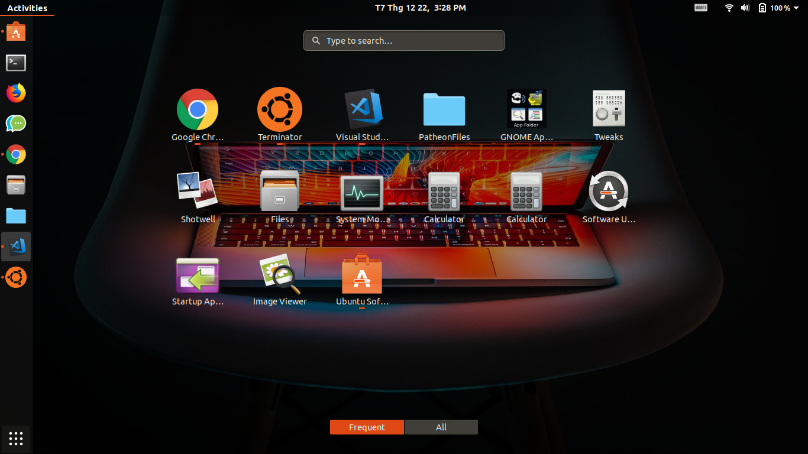

# For Ubuntu

## [Fcitx-Unikey](https://www.sitecuatui.com/fcitx-unikey/)

```
sudo apt-get install fcitx-unikey
im-config -n fcitx
sudo wget https://raw.githubusercontent.com/fcitx/fcitx-unikey/ccffd3b77b78312f135f3958c9a4db7e98562e11/src/fcitx-unikey.desc -O /usr/share/fcitx/configdesc/fcitx-unikey.desc

=> logout => Fcitx > Configure > untick "Only Show Current Language" > add Unikey
```
## [Elementary OS's Pantheon File manager](https://github.com/elementary/files)
DEMO: 
[https://www.youtube.com/watch?v=aQw4_7Ue8wc](https://www.youtube.com/watch?v=aQw4_7Ue8wc)


```
sudo add-apt-repository ppa:elementary-os/stable
sudo apt-get update
sudo apt-get install pantheon-files
```
Configure Pantheon-files to use double click

```
gsettings set io.elementary.files.preferences single-click false
```
or
```
gsettings set org.pantheon.files.preferences single-click false
```
## Change An Application Icon in Ubuntu Unity

```
cd /usr/share/applications
sudo nano firefox.desktop
```

Set ```Icon=/path/of/your/icon```

## Terminator

```bash
sudo add-apt-repository ppa:gnome-terminator
sudo apt-get update
sudo apt-get install terminator
```

Download file ```config.terminator``` in ```configs``` folder into your machine and change your default configuration by: 

```bash
sudo bash -c "cat config.terminator > ~/.config/terminator/config"
```

## Enable 'minimize on click' on Ubuntu dock

Open Terminal and run
```
gsettings set org.gnome.shell.extensions.dash-to-dock click-action 'minimize'
```
To revert to the default option, simply run 
```
gsettings reset org.gnome.shell.extensions.dash-to-dock click-action
```
Also, run the following to see all possible permitted values 
```
gsettings range org.gnome.shell.extensions.dash-to-dock click-action
```

## Reorder your launch application [gnome-appfolders-manager](http://www.muflone.com/jekyll/gnome-appfolders-manager/english/)
Install [```http://www.muflone.com/gnome-appfolders-manager/english/install.html```](http://www.muflone.com/gnome-appfolders-manager/english/install.html)



## Gnome tweak tool
```bash
sudo apt install gnome-tweak-tool
```

## Background for Grub (1920x1200)
```bash
sudo cp ./images/grub-background.jpg /boot/grub/
sudo update-grub
```
```
Generating grub configuration file ...
Found background image: grub-background.jpg
Found linux image: /boot/vmlinuz-x.x.x-43-generic
Found initrd image: /boot/initrd.img-x.x.0-43-generic
Found linux image: /boot/vmlinuz-x.x.x-42-generic
Found initrd image: /boot/initrd.img-x.x.0-42-generic
Found Windows Boot Manager on /dev/sda1@/EFI/Microsoft/Boot/bootmgfw.efi
Adding boot menu entry for EFI firmware configuration
done
```

# Errors

## [No sound Ubuntu](https://help.ubuntu.com/community/SoundTroubleshootingProcedure)

```
sudo apt-get remove --purge pulseaudio pulseaudio-utils pavucontrol
killall pulseaudio ; rm -r ~/.config/pulse ; rm -r ~/.pulse*
mkdir ~/.config/pulse
sudo apt-get install pulseaudio pulseaudio-utils pavucontrol
```